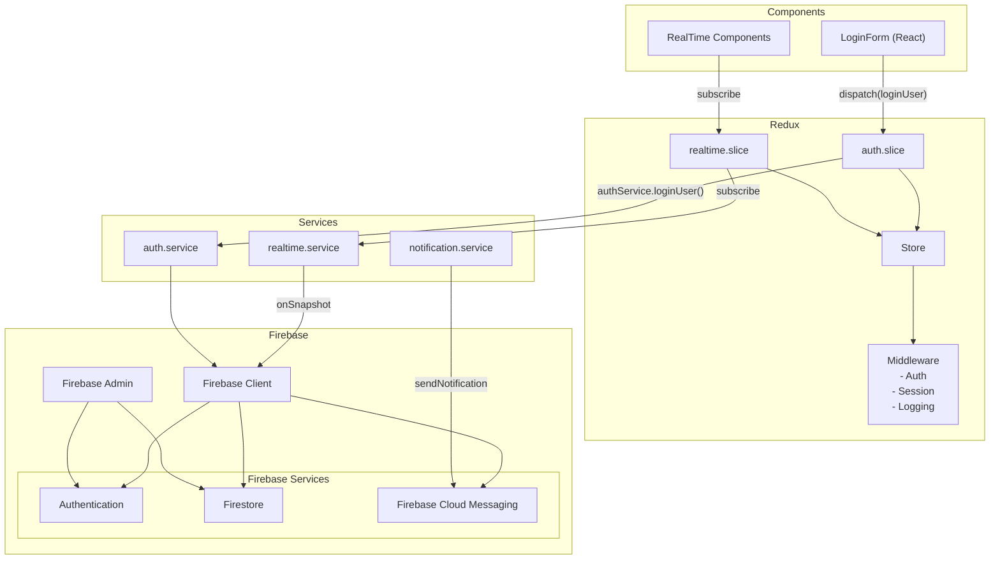

# WSA BROKERS - Documentación de Arquitectura

## Índice

- [WSA BROKERS - Documentación de Arquitectura](#wsa-brokers---documentación-de-arquitectura)
  - [Índice](#índice)
  - [Visión General](#visión-general)
  - [Estructura del Proyecto](#estructura-del-proyecto)
  - [Diagrama de Arquitectura](#diagrama-de-arquitectura)
  - [Interfaces Core](#interfaces-core)
    - [Usuario y Autenticación](#usuario-y-autenticación)
    - [Servicios](#servicios)
  - [Implementación por Capas](#implementación-por-capas)
    - [Redux Store](#redux-store)
    - [Middleware](#middleware)
  - [Flujos de Trabajo](#flujos-de-trabajo)
    - [Proceso de Autenticación](#proceso-de-autenticación)
    - [Validaciones de Acceso](#validaciones-de-acceso)
  - [Servicios en Tiempo Real](#servicios-en-tiempo-real)
    - [Firebase Config](#firebase-config)
    - [Manejo de Errores](#manejo-de-errores)

## Visión General

La arquitectura del sistema está diseñada siguiendo los principios SOLID y el patrón de capas, con una clara separación de responsabilidades:

- Componentes UI (React/Next.js)
- Gestión de Estado (Redux)
- Lógica de Negocio (Services)
- Acceso a Datos (Firebase)

Características principales:

- Autenticación y Autorización con Firebase
- Sincronización en tiempo real con Firestore
- Sistema de notificaciones push (FCM)
- Control de sesión única por usuario
- Validación granular de roles y permisos
- Logging centralizado de acciones

## Estructura del Proyecto

app/
├── models/ # Interfaces y tipos base
│ └── user.ts
├── redux/
│ └── slices/ # Estado global
│ ├── auth.slice.ts
│ └── auth.types.ts
├── services/
│ ├── interfaces/ # Contratos de servicios
│ │ └── auth.interface.ts
│ └── impl/ # Implementaciones
│ └── firebase.auth.service.ts
├── firebase/ # Configuración Firebase
│ ├── admin.ts
│ └── client.ts
└── lib/
└── errors/ # Manejo de errores
├── auth.errors.ts
└── index.ts

## Diagrama de Arquitectura



## Interfaces Core

#### Usuario y Autenticación

```typescript
interface UserProfile {
  uid: string
  email: string
  displayName?: string
  claims: string[]
  lastLogin?: Date
  lastActivity?: Date
  blocked: boolean
  deleted: boolean
  emailVerified: boolean
}

interface Credentials {
  email: string
  password: string
}
```

#### Servicios

```typescript
interface AuthService {
  loginUser(credentials: Credentials): Promise<UserProfile>
  validateUserAccess(uid: string): Promise<void>
  syncUserClaims(uid: string): Promise<void>
  updateUserActivity(uid: string): Promise<void>
  checkActiveSessions(uid: string): Promise<void>
}

interface RealtimeService {
  subscribe<T>(
    collection: string,
    query: FirestoreQuery,
    callback: (data: T[]) => void
  ): () => void
}

interface NotificationService {
  initialize(): Promise<void>
  requestPermission(): Promise<boolean>
  onMessage(callback: (payload: NotificationPayload) => void): void
  sendNotification(userId: string, notification: Notification): Promise<void>
}
```

## Implementación por Capas

#### Redux Store

```typescript
export interface AuthState {
  user: UserProfile | null
  status: 'idle' | 'loading' | 'authenticated' | 'error'
  error?: string
}

const authSlice = createSlice({
  name: 'auth',
  initialState,
  reducers: {},
  extraReducers: (builder) => {
    builder
      .addCase(loginUser.pending, (state) => {
        state.status = 'loading'
      })
      .addCase(loginUser.fulfilled, (state, action) => {
        state.user = action.payload
        state.status = 'authenticated'
      })
  },
})
```

#### Middleware

```typescript
// Auth Middleware
authMiddleware.startListening({
  actionCreator: loginUser.fulfilled,
  effect: async (action) => {
    localStorage.setItem('token', action.payload.token)
    startTokenRefresh()
  },
})

// Session Middleware
sessionMiddleware.startListening({
  predicate: (action) => action.type.startsWith('auth/'),
  effect: async (action, api) => {
    if (api.getState().auth.user) {
      await authService.updateUserActivity(api.getState().auth.user.uid)
    }
  },
})
```

## Flujos de Trabajo

#### Proceso de Autenticación

1. Usuario ingresa credenciales en LoginForm
2. LoginForm dispara action loginUser
3. AuthSlice procesa la acción
4. AuthService realiza:

   - Autenticación con Firebase
   - Validación de acceso y permisos
   - Obtención de perfil y claims
   - Actualización de actividad
   - Control de sesión única

#### Validaciones de Acceso

El sistema verifica:

- Email verificado
- Usuario no bloqueado
- Usuario no eliminado (soft delete)
- Sesión única activa
- Roles y permisos válidos

## Servicios en Tiempo Real

#### Firebase Config

```typescript
// Cliente
const firebaseConfig = {
  apiKey: process.env.NEXT_PUBLIC_FIREBASE_API_KEY,
  authDomain: process.env.NEXT_PUBLIC_FIREBASE_AUTH_DOMAIN,
  projectId: process.env.NEXT_PUBLIC_FIREBASE_PROJECT_ID,
}

export const firebaseClient =
  getApps().length === 0 ? initializeApp(firebaseConfig) : getApps()[0]

// Admin
if (!admin.apps.length) {
  admin.initializeApp({
    credential: admin.credential.cert({
      projectId: process.env.FIREBASE_PROJECT_ID,
      clientEmail: process.env.FIREBASE_CLIENT_EMAIL,
      privateKey: process.env.FIREBASE_PRIVATE_KEY?.replace(/\\n/g, '\n'),
    }),
  })
}
```

#### Manejo de Errores

```typescript
export class AuthError extends Error {
  constructor(message: string) {
    super(message)
    this.name = 'AuthError'
  }
}

export class BlockedUserError extends AuthError {
  constructor() {
    super('User is blocked')
    this.name = 'BlockedUserError'
  }
}

export class DeletedUserError extends AuthError {
  constructor() {
    super('User has been deleted')
    this.name = 'DeletedUserError'
  }
}
```
